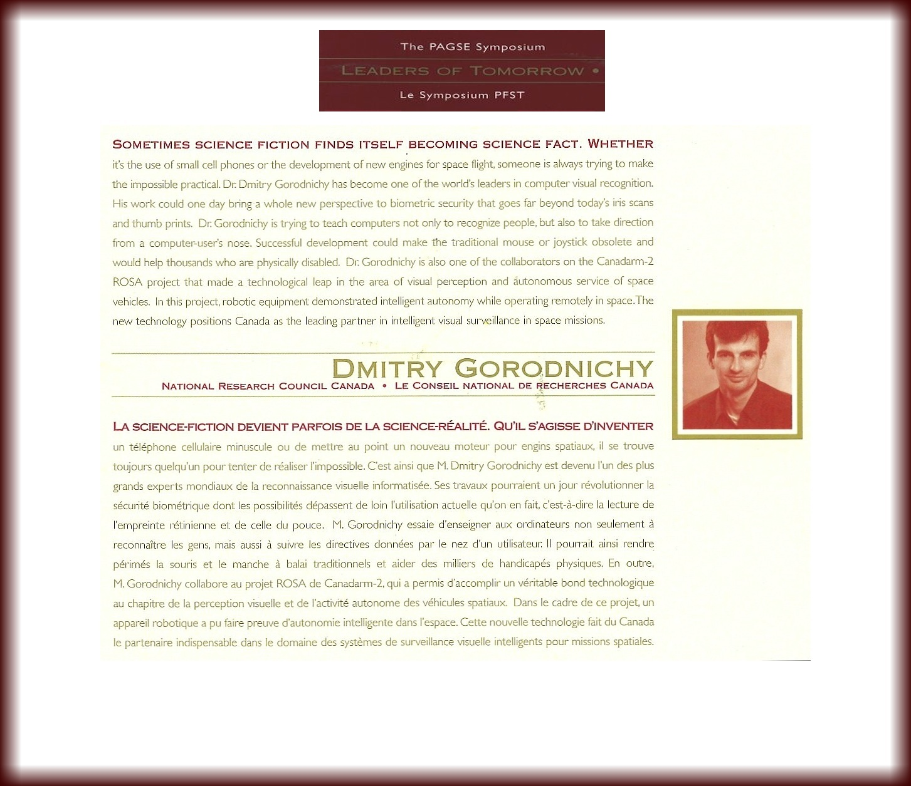

<!--  -->
<!-- !(http://www.gorodnichy.ca/images/dmitry_gorodnichy.jpg) does not work-->

 

<!-- **Quick links:** -->

**Popular:**
<!--   -->

[“Border Wait Time Prediction and Analysis” Application (iTrack Border)](https://itrack.shinyapps.io/border)

[Public Service Employee Survey results interactive tracker (iTrack PSES)](https://itrack.shinyapps.io/PSES/)

<!-- ["Analysis of the effect of ageing, age, and other factors on iris recognition performance using NEXUS scores dataset"](https://digital-library.theiet.org/content/journals/10.1049/iet-bmt.2018.5105), IET Biometrics journal, Jan 2019.  -->

<!-- ["Design and Evaluation of Biometric-enabled Interview-Assisting Traveller Screening technology for Automated Border Control" (a.k.a Automated Lie Detection systems)](), DRDC Report, Oct 2018. -->

<!-- 
<a href="http://pubs.drdc-rddc.gc.ca/BASIS/pcandid/www/engpub/SDW?M%3D1%26W%3DAUTHOR+inc+phrase+like+%22Gorodnichy%22+sort+by+repdate+descend">"Analysis of Risks and Trends in Automated Border Control (ART in ABC)", DRDC Report, Sep. 2016</a>; 
<a href="https://sites.google.com/site/vistercanada/projects/DRDC-CSS#TOC-ART-in-ABC:-Risk-analysis-of-face-and-iris-biometrics-in-border-access-control-applications-">ART in ABC", Presentation at Frontex, July 2015</a>.
 

<a href="https://sites.google.com/site/dmitrygorodnichy/publications#TOC-Face-Recognition-in-Video">Evaluation of Video Analytics and Face Recognition technology,  DRDC reports, July 2014</a>;  <a href="https://www.nist.gov/itl/iad/image-group/ibpc-2014-presentations">Presentations at NIST</a>.

-->

### *Greetings,  Bonjour, Вітаю, День Добрый !* 
<!-- {style="padding-top: 0px;"} -->

I'm a Senior Scientist at the <i>Canada Border Services Agency</i>, 
<!-- and [Adjunct Professor at the University of Ottawa](http://engineering.uottawa.ca/eecs/people/gorodnichy-dmitry), -->
working on the applications of *Artificial Intelligence* and *Data Science* for border control.

<!-- Automated Border Control, Biometrics and Video Analytics. -->

I have Ph.D. in Applied Mathematics and Computer Science, authored over a hundred of scientific papers, made over a dozen of inventions, including the [Nouse®](www.nouse.ca) (Nose as Mouse) Intelligent Vision Interface, 
<!-- which is used by Ontario long-care facilities and featured by the [Canada Science and Technology Museum](http://collect-connect.cstmcweb.ca/2015/02/community-support-click-nose/). -->
which was [featured world-wide](https://sites.google.com/site/dmitrygorodnichy/Nouse/in-news) and is now in [Canada Science and Technology Museum](http://collect-connect.cstmcweb.ca/2015/02/community-support-click-nose/).
<!-- organized and chaired a number of conferences in Video Anaytics, Neural Networks and Video Recognition, published by IEEE.  -->

Recently, I've been developing Web Applications that leverage the value of Open Canada data using various open source Data Science and  Machine Learning tools: [iTrack PSES](https://itrack.shinyapps.io/PSES) and [iTrack Border](https://itrack.shinyapps.io/border).

Apart of Science, I enjoy sports (once a member of the Ukrainian U-14 Olympic and the University of Alberta gymnastics varsity teams), compose [music](http://gorodnichy.ca/First-Day-Of-Love.htm) and interpret in Russian and Ukrainian my favourite
<!-- I express my feelings in songs and bosa-nova interpretations.  -->
<!-- Among other things, I'm Level 9 gymnast, interpret -->
[bosa-nova songs](http://bookdown.org/gorodnichy/jobim). 

<!-- I am also Adjunct Professor at the <a href="http://engineering.uottawa.ca/eecs/people/gorodnichy-dmitry">University of Ottawa</a> and a co-founder of <a href="http://ivim.ca/">IVIM Inc.</a> - the exclusive provider of <a href="http://www.nouse.ca/">Nouse®</a>, which is the<i> Ontario Ministry of Health and Long-Care</i> recommended mouse alternative technology that I have developed at the National Research Council of Canada. -->

<!-- This site mirrors <a href="http://www.gorodnichy.ca/">www.gorodnichy.ca</a> and serves to archive information related to my scientific and engineering work. -->

<!-- We speak English, français, українською и по-русски and  -->

I can be reached at *[name]@gorodnichy.ca* or *[name]@ivim.ca*.

Enjoy exploring more!

Elsewhere:  
<!-- [Stackoverflow](https://stackoverflow.com/users/6805670/ivim), -->
[GCConnex](https://gcconnex.gc.ca/profile/Dmitry.Gorodnichy),
[GitHub](https://github.com/gorodnichy),
[Stack Exchange](https://stackexchange.com/users/9151121/ivim),
[ResearchGate](https://www.researchgate.net/profile/Dmitry_Gorodnichy),
[GoogleScholar](https://scholar.google.ca/citations?user=T_Zi7wYAAAAJ),
[LinkedIn](http://www.linkedin.com/pub/dmitry-gorodnichy),
 <!-- [Google+](https://plus.google.com/114397903084174932514), -->
[Facebook](https://www.facebook.com/people/Dmitry-O-Gorodnichy/100010429878764),
[LyricsTranslate](https://lyricstranslate.com/en/translator/dmitry-gorodnichy)
<!-- [Ask Google]() -->

<!-- (accès limité)  -->

***

 

<!-- </img> -->

Copyright © Dmitry O. Gorodnichy  
 <!-- Site built using [R Markdown](http://rmarkdown.rstudio.com/rmarkdown_websites.html) and supported by GitHub -->
 www.gorodnichy.ca
 

